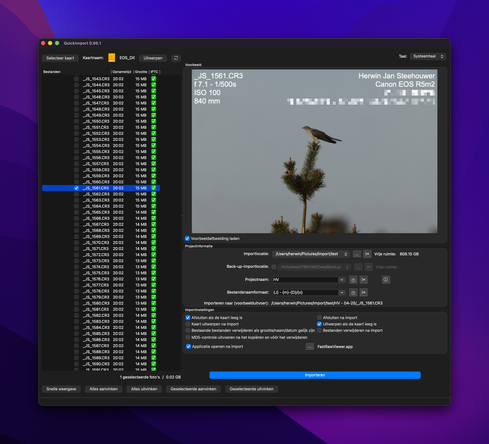

# QuickImport #




**Streamline your workflow**  
QuickImport makes it fast and simple to transfer photos from your memory card straight into your project folders. It’s a lightweight utility designed for photographers who want efficiency without the clutter.  

**Effortless photo workflow**  
1. Capture your shots  
2. Import them directly to your hard disk with QuickImport  
3. Cull your selection in your favorite review tool  
4. Edit seamlessly in your preferred image editor  

**Key Features**  
- **Selective Import:** Bring in only the photos you need  
- **Quick Preview:** Realtime or Hit *Enter* or double-click to check images instantly (optional)  
- **Flexible Destination:** Organize files into the right project folder  
- **Data Integrity:** MD5 checksum for safe, verified transfers  
- **Multi-Location Import:** Copy files to multiple destinations at once  
- **Custom Naming:** Rename files and folders with flexible templates  

Experience a smoother, safer, and faster photo import process with **QuickImport**.

## Building from source

Requirements: CMake ≥ 3.21, Qt ≥ 6.11 (Core, Gui, Concurrent, Widgets,
LinguistTools), [LibRaw](https://www.libraw.org/) and [Exiv2](https://exiv2.org/).

Qt 6.11 is a hard requirement, not a preference: older Qt draws the
pre-Tahoe macOS control style, which on macOS 26 gives square push buttons
and a focus ring that sits detached above and below the default button.

```sh
cmake -S . -B build \
    -DCMAKE_PREFIX_PATH=/path/to/Qt/6.11.0/macos \
    -DLIBRAW_ROOT=/path/to/libraw \
    -DEXIV2_ROOT=/path/to/exiv2
cmake --build build
```

`LIBRAW_ROOT` and `EXIV2_ROOT` point at an installation prefix or a
source/build tree; without them CMake falls back to common locations such as
`/opt/homebrew` and `/usr/local` (the environment variables `LIBRAW_ROOT` /
`EXIV2_ROOT` work too).

**macOS note:** the project targets macOS 14.0, but Homebrew builds its
libraries for your current macOS version only. To produce a binary that runs
on macOS 14, build LibRaw and Exiv2 yourself with
`MACOSX_DEPLOYMENT_TARGET=14.0` and point the `*_ROOT` options at those
builds.

LibRaw must be configured with `--disable-lcms`. QuickImport only reads
metadata and embedded thumbnails, so it never touches LibRaw's colour
pipeline — the only thing that needs Little-CMS — while Homebrew's
`liblcms2` is built for the current macOS and would drag the deployment
target up with it:

```sh
cd /path/to/LibRaw
MACOSX_DEPLOYMENT_TARGET=14.0 ./configure --disable-lcms
MACOSX_DEPLOYMENT_TARGET=14.0 make -j8
```

## Making a release

The version in `CMakeLists.txt` is what you are *working on*; the `vX.Y` git
tags are what has *shipped*. Never create a tag by hand and never move one
that already exists — `release.sh` creates it as the very last step.

Day to day:

1. Commit as usual. Add anything a user would notice under `## [Unreleased]`
   in CHANGELOG.md while it is fresh.
2. Straight after a release, bump `project(QuickImport VERSION ...)` to the
   next patch number, so builds from the main branch can never be confused
   with the released version.

When you want to ship:

1. Decide the number. Bug fixes only → bump the last part (0.96.1). New
   features → bump the middle (0.97). It only has to be higher than the
   highest existing tag; `release.sh` refuses otherwise.
2. Set it in `CMakeLists.txt` if it is not already right.
3. In CHANGELOG.md, rename `## [Unreleased]` to `## [X.Y.Z] - <date>` and
   start a fresh empty `## [Unreleased]` above it.
4. Write `release-notes/X.Y.Z.md` — the user-facing story, not the commit
   log. Look at `release-notes/0.96.md` for the shape.
5. Run `./release.sh`. It walks through version and working-tree checks, the
   build, a look at the app, the notes, and only then tags and publishes.
   `./release.sh --dry-run` does everything except the publishing.

## Packaging a release build (macOS)

The development build resolves Qt through `@rpath` into your Qt installation
and links LibRaw by absolute path, so it only runs on the machine that built
it. `package-macos.sh` produces a self-contained bundle:

```sh
./package-macos.sh          # build, deploy, verify and ad-hoc sign
./package-macos.sh --dmg    # ... and wrap it in a DMG
```

It does a clean release build in `build-release/`, runs `macdeployqt`,
copies the LibRaw dylib into `Contents/Frameworks`, and then verifies two
things that are easy to get wrong and hard to notice:

- every binary in the bundle resolves only to system libraries or
  bundle-relative paths, so nothing is picked up from the build machine;
- nothing inside the bundle needs a newer macOS than the deployment target,
  which would make the app refuse to launch on the versions it claims to
  support.

Either check failing aborts the script. `QT_DIR`, `LIBRAW_ROOT`, `EXIV2_ROOT`
and `BUILD_DIR` override the defaults.

The result is **ad-hoc signed**: fine for your own machines, but other people
will hit Gatekeeper. Distributing more widely needs a "Developer ID
Application" certificate (a paid Apple Developer Program membership) and a
notarisation step, neither of which the script does yet.
